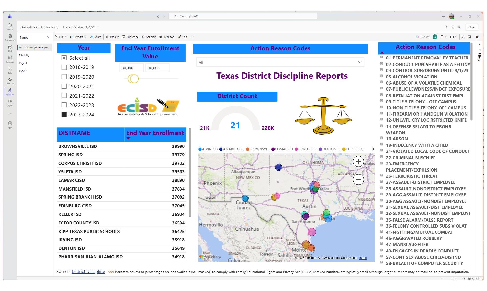
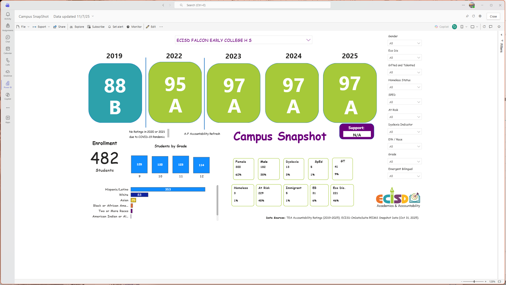
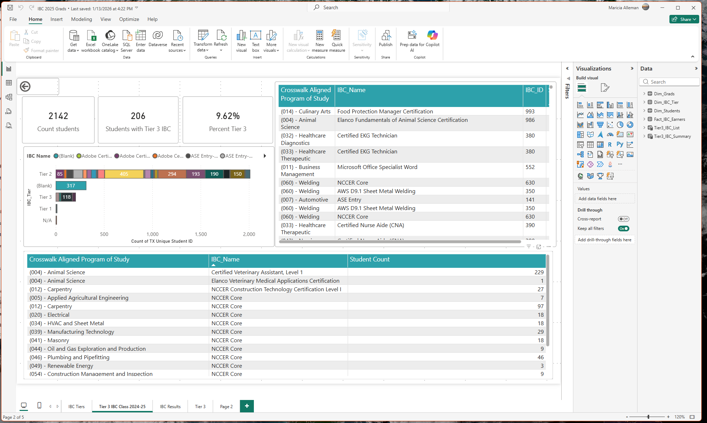
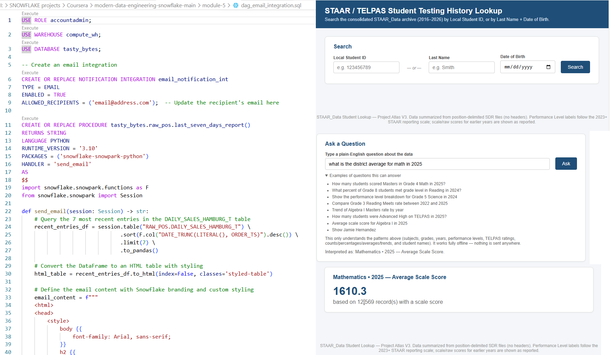
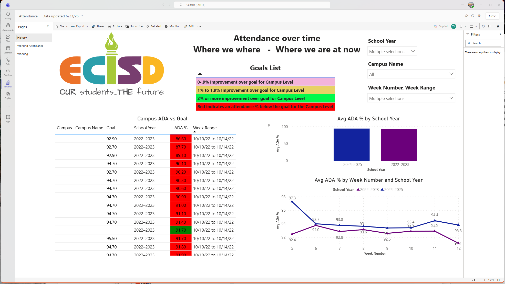

# Education Analytics Showcase

A portfolio of K-12 education analytics projects demonstrating dashboard design, reporting workflows, data modeling, and decision-support solutions developed using Power BI, SQL, and public education data.# Education-Analytics-Showcase
Education data analytics showcase featuring accountability, assessment, CCMR, attendance, and discipline reporting solutions.
# Education Analytics Showcase

## Discipline Analytics

Public Texas discipline data used to compare districts, student groups, and discipline actions.

---

## Accountability Analytics

Accountability and campus performance reporting.

---

## CCMR & Industry-Based Certifications

College, Career, and Military Readiness reporting.

---

## Assessment Analytics

Assessment reporting, performance levels, and growth analysis.

---

## Attendance Analytics

Attendance trends and chronic absenteeism monitoring.
